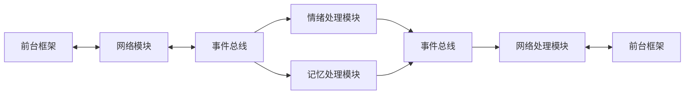

# server 层
> server 层是框架的核心，以网络通信模块，对话处理模块组成。

## 网络通信模块
- 网络通信模块位于 network/ 目录下，负责处理所有网络通信相关功能
- 主要包含 adapters/ 目录下的 socket_routes.py 和 http_routes.py，分别处理 socket 和 http 协议通信
- 网络通信模块仅负责消息传输，不涉及业务逻辑处理

## 对话处理模块
- 对话处理模块位于 processors/dialogue/ 目录下
- input.py 负责对话输入的预处理和规范化
- output.py 负责对话输出的格式化和后处理
- decision.py 负责对话的决策处理，包括回复策略和对话流程控制
- 对话相关的模板和关键词定义存储在 data/common/dialogue/ 目录下

## 情绪处理模块
- 情绪处理模块位于 processors/emotion/ 目录下
- processor.py 负责情绪状态的识别和处理
- manager.py 负责情绪状态的管理和转换
- emotion_state.py 定义情绪模型和状态转换规则
- 情绪相关的状态定义和触发条件配置存储在 data/common/emotions/ 目录下

## 记忆处理模块
- 记忆处理模块位于 processors/memory/ 目录下
- storage.py 实现记忆存储功能，负责记忆的持久化
- retrieval.py 实现记忆检索功能，包含 RAG (检索增强生成) 模块
- decision.py 负责记忆的决策处理，控制记忆的写入和检索策略
- 记忆相关的模板和权重配置存储在 data/common/memory/ 目录下
- 写入和检索功能通过独立的类实现，确保功能解耦
- 记忆决策模块根据预设规则和当前上下文决定记忆的处理流程

## 事件总线
- 事件总线位于 core/event_bus.py，是系统的消息中枢
- 采用发布-订阅模式，负责处理模块间的事件分发和通信
- 支持同步和异步事件处理，确保消息的可靠传递
- 通过优先级机制管理事件处理顺序
- 提供事件过滤和转换功能，实现灵活的消息路由

## 网络处理模块
- 网络处理模块是系统的输入输出层，负责前后端通信
- 实现请求的解析、验证和响应封装
- 支持多种数据格式和协议，确保通信的兼容性
- 集成错误处理和重试机制，提高系统稳定性
- 提供消息队列功能，处理高并发场景

## 前台框架
- 前台框架是系统的展示层，负责用户界面和交互
- 采用组件化设计，支持灵活的界面定制
- 实现与后端的双向通信，保证数据实时同步
- 集成状态管理，维护前端数据一致性
- 提供丰富的UI组件和交互效果

# 业务流程


# 项目架构


```
server/
├── data/                       # 数据目录
│   ├── avatars/               # 人设数据
│   │   ├── default/           # 默认人设
│   │   │   ├── personality.yaml   # 性格特征
│   │   │   ├── background.yaml    # 背景设定
│   │   │   └── responses.yaml     # 回复模板
│   │   └── custom/            # 自定义人设
│   │
│   ├── base/                  # 最高指令层
│   │   ├── rules.yaml         # 基础规则
│   │   ├── constraints.yaml    # 约束条件
│   │   └── priorities.yaml     # 优先级设定
│   │
│   └── common/                # 通用数据
│       ├── emotions/          # 情绪数据
│       │   ├── states.yaml    # 情绪状态定义
│       │   └── triggers.yaml  # 情绪触发条件
│       ├── memory/            # 记忆数据
│       │   ├── templates.yaml # 记忆模板
│       │   └── weights.yaml   # 记忆权重
│       └── dialogue/          # 对话数据
│           ├── patterns.yaml  # 对话模式
│           └── keywords.yaml  # 关键词库
├── core/                       # 核心组件
│   ├── __init__.py
│   ├── event_bus.py           # 事件总线实现
│   ├── container.py           # 依赖注入容器
│   └── interfaces.py          # 核心接口定义
│
├── network/                    # 网络层
│   ├── __init__.py
│   └── routes/              # 适配器模式处理不同协议
│       ├── __init__.py
|       ├── message_handler.py # 消息处理接口
│       ├── socket_routes.py  # socket 通信实现
│       └── http_routes.py    # http 通信实现
│   
├── processors/                 # 处理器模块
│   ├── __init__.py
│   ├── dialogue/             
│   │   ├── __init__.py
│   │   ├── input.py            # 对话输入处理
│   │   ├── output.py           # 对话输出处理
|   |   └── decision.py         # 对话决策处理
│   ├── emotion/                 # 情绪处理模块
│   │   ├── __init__.py
│   │   ├── processor.py         # 情绪处理
│   │   ├── manager.py           # 情绪管理
|   |   └── emotion_state.py           # 情绪模型
│   └── memory/                 # 记忆处理模块
│       ├── __init__.py       
│       ├── storage.py          # 记忆存储
│       ├── retrieval.py        # 记忆检索
|       └── decision.py         # 记忆决策
│
├── models/                     # 数据模型
│   ├── __init__.py
│   ├── message.py              # 消息模型
│   ├── event.py                # 事件模型
│   └── state.py                # 状态模型
│
├── services/                   # 业务服务
│   ├── __init__.py
│   └── orchestrator.py         # 业务流程编排
│
├── utils/                      # 工具类
│   ├── __init__.py
│   ├── logger.py               # 日志工具
│   └── config.py               # 配置工具
│
├── config/                     # 配置文件
│   ├── default.yaml            # 主配置文件
│   └── logging.yaml            # 日志配置文件
│
├── tests/                      # 测试
│   ├── __init__.py
│   └── unit/
│       ├── test_event_bus.py
│       └── test_processors.py
│
├── main.py                    # 入口文件
├── API.md                     # API 文档
├── requirements.txt           # 依赖文件
└── server_readme.md           # 模块说明文档
```